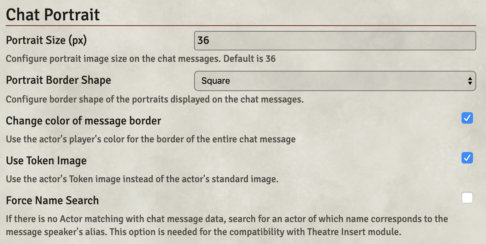
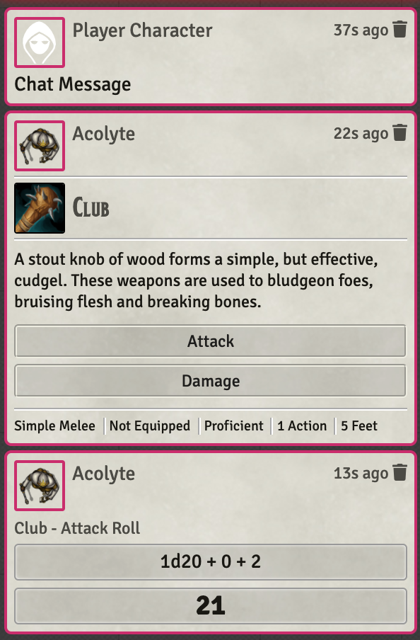

# Chat Portrait

A Foundry VTT module that displays the Actor's portrait images on the chat messages.

## Changelog
- 0.2.2
   - New Feature: Configurable option to use the player's color as blended background color of the message. by @Biggles
   - Translation: Updated German translation by @Biggles

- 0.2.1
    - Fix: Fixed the bug that the configuration window is not opened
    - Translation: Spanish translation by @lozalojo
    - Translation: German translation by @envy

- 0.2.0
    - Migrated to TypeScript
    - New Feature: Separated configuration window
    - New Feature: Configurable option for portrait border's color and width
    - New Feature: Configurable option for placing chat flavor text next to portrait
    - Fixed various issues
    - Translation: Castilian translation by @HonzoNebro

- 0.1.4
    - New Feature: Configurable option for using the player's color on chat message border. by @gatesvp
    - New Feature: Configurable option for portrait image size
    - Fix: Fixed the problem that non-square images are squeezed. by @megastruktur
